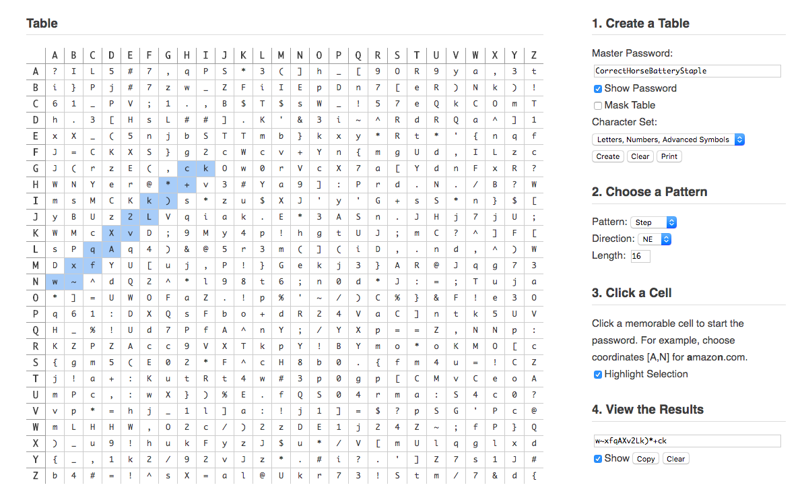

# Tabula

*A simple, stateless password manager*

**What does it do?** Tabula helps you create and remember strong passwords for each site without having to store them anywhere.

**How does it work?** When you enter a master password, a table of characters that's unique to your password is created. You then use this table to generate each site-specific password by starting at a memorable cell and following a pattern across the grid. When you need a site's password in the future, just regenerate this table using your master password, find the starting cell, and follow the pattern. This way you can remember strong passwords for every site without the risk of storing them anywhere.

Try it out [here](https://pstblog.com/projects/tabula.html), or read more about it on my [blog](https://pstblog.com/2018/01/30/password-manager).

**Note:** This project is still experimental, so it needs more scrutiny before I'd recommend using it. If you do, print out a copy of the table so you have a backup if I change the code.

 

## About

The name Tabula comes from a cryptographic tool called a [tabula recta](https://en.wikipedia.org/wiki/Tabula_recta), which is used to create ciphers. I came across this concept while reading an interesting [blog post](http://blog.jgc.org/2010/12/write-your-passwords-down.html) where the author describes using a tabula to generate his own passwords. I decided to try to make the technique a little more user friendly automating a few steps, so this is the result.

The table of characters is created by seeding a random number generator ([seedrandom.js](https://github.com/davidbau/seedrandom)) with your master password after passing it through [scrypt](https://github.com/bitwiseshiftleft/sjcl/blob/master/core/scrypt.js). The end result is a unique table that will be re-created whenever you enter your master password in the future. This makes it easy to have many strong, site-specific passwords while just remembering a master password and a pattern.

## Characters

These are the characters that can be used to generate passwords:

Letters, numbers, advanced symbols: `AEIOUaeiouBCDFGHJKLMNPQRSTVWXYZbcdfghjklmnpqrstvwxyz0123456789!@#$%^&*()?,=[]_:+*'~;/.{}`

Letters, numbers, symbols: `AEIOUaeiouBCDFGHJKLMNPQRSTVWXYZbcdfghjklmnpqrstvwxyz0123456789!@#$%^&*()`

Letters, numbers: `AEIOUaeiouBCDFGHJKLMNPQRSTVWXYZbcdfghjklmnpqrstvwxyz0123456789`

Letters: `AEIOUaeiouBCDFGHJKLMNPQRSTVWXYZbcdfghjklmnpqrstvwxyz`

Numbers: `0123456789`

## Security

For web security, everything is included in a single HTML file that doesn't depend on any externally loaded scripts or make any network requests (your master password is never sent anywhere). As a result, you can still use this page when you're offline, or download the file and use it locally. Also, you could print out the table and only use the webpage in situations where you don't have access to a physical copy.  Depending on interest, I'm considering building an Electron or React Native app to avoid the web security issues altogether.  

In terms of cryptography, there are a few threats that I go more in-depth about in my [blogpost](https://pstblog.com/2018/01/30/password-manager).  The main one I'm concerned about is the situation where someone's table or master password is revealed because this opens them up to a brute force attack.  I'm looking for advice on how to reduce this risk.  

These are the current sha256 checksums of the files:

`tabula.html`:
```
$ shasum -pa 256 tabula.html
0c6b6e8fb6d58bce5bcc0a23688f70142f6c03b354f5de195dc2e3ed392e2a9f ?tabula.html
```

`tabula-embed.html`:
```
$ shasum -pa 256 tabula-embed.html
e6ac1e50b61e46f9cfa5072c16497907cd8b9329c83a8fad6d62701ea26e9558 ?tabula-embed.html
```
